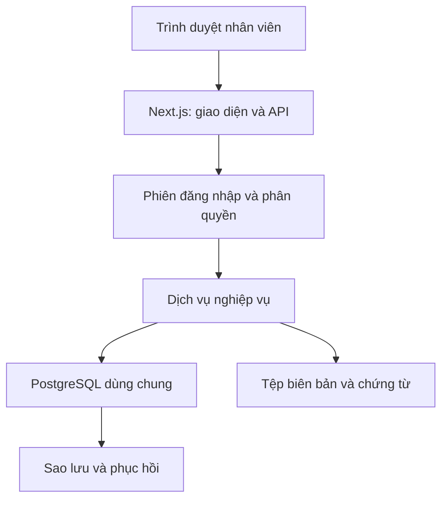

# Kiến trúc và phạm vi

## 1. Mô hình triển khai

Ứng dụng web dùng chung trong một công ty. Trình duyệt các nhân viên kết nối cùng máy chủ Next.js qua HTTPS. Máy chủ xác thực, kiểm tra quyền và xử lý giao dịch PostgreSQL. Không lưu dữ liệu tồn kho hoặc vai trò tin cậy trong trình duyệt.

Đây là quyết định thiết kế cho môi trường triển khai của công ty, chưa phải kết quả cài đặt hay triển khai. Cấu hình máy chủ, tên miền, thư lưu trữ tệp và dịch vụ sao lưu xác định ở bước vận hành.

## 2. Ranh giới module

| Module | Sở hữu | Không tự làm |
|---|---|---|
| Identity | Tài khoản, phiên, vai trò, phạm vi dự án | Nhận vai trò từ client |
| Catalog | Mã hàng, đơn vị, kho, đối tác | Sửa tồn đầu kỳ trực tiếp |
| Projects | Hợp đồng, gói thầu, nhu cầu, phụ lục | Tự tăng tồn hoặc tự ghi phiếu nhập |
| Purchasing | Đơn mua, phân bổ về dự án, theo dõi nhận | Tính lượng đã nhận từ trạng thái nhập tay |
| Inventory | Chứng từ, tồn, giữ hàng, giá vốn, serial | Sửa ngược chứng từ đã ghi sổ |
| Delivery | Xuất giao, bàn giao, trả giảm giao | Đồng nhất xuất kho với khách đã nhận |
| Reporting | Tổng hợp từ chứng từ và sổ | Ghi sửa dữ liệu nguồn |
| Migration | Vùng tạm, ánh xạ, đối soát, nhập chuyển đổi | Tự cộng tồn từ cả hai nguồn |

Một giao dịch có thể đi qua nhiều module nhưng phải có một dịch vụ điều phối và một transaction. Route API không viết SQL nghiệp vụ rải rác.

## 3. Cấu trúc mã nguồn dự kiến

| Thư mục | Vai trò |
|---|---|
| `app/` | Trang và route handlers |
| `components/` | Giao diện dùng chung |
| `modules/identity/` | Xác thực và kiểm tra quyền |
| `modules/catalog/` | Danh mục |
| `modules/projects/` | Dự án, gói thầu, kế hoạch |
| `modules/purchasing/` | Đơn mua và phân bổ |
| `modules/inventory/` | Ghi sổ, giữ hàng, giá vốn |
| `modules/delivery/` | Bàn giao và trả hàng |
| `modules/reports/` | Truy vấn báo cáo và export |
| `db/migrations/` | Schema PostgreSQL có phiên bản |
| `scripts/migration/` | Đọc nguồn cũ, tạo vùng tạm, đối soát |
| `tests/` | Kiểm thử nghiệp vụ và API |
| `docs/` | Đặc tả trong bộ thiết kế này |

Các thư mục mã nguồn trên là cấu trúc sẽ triển khai, chưa được tạo thành ứng dụng trong bản tài liệu này.

## 4. Màn hình

| Màn hình | Nội dung và hành động |
|---|---|
| Tổng quan | Dự án trễ hạn; hàng còn phải giao; thiếu nguồn hàng; chứng từ chờ duyệt |
| Dự án | Tìm/lọc, tạo dự án; chi tiết gồm gói thầu, kế hoạch, nguồn hàng, giao/bàn giao, lịch sử |
| Chi tiết gói thầu | Bảng từng dòng: kế hoạch, đang đặt, đang giữ, đã giao, đã bàn giao, còn thiếu; mở chứng từ nguồn |
| Đơn mua | Tạo đơn; duyệt; nhập từng đợt; lượng còn nhận; hủy phần chưa nhận |
| Tồn kho | Theo hàng và kho: thực tế, giữ, khả dụng; tra serial và sổ biến động |
| Chứng từ kho | Nhập, xuất, chuyển, trả hàng, điều chỉnh; trạng thái và lịch sử phê duyệt |
| Giữ hàng | Dự án/gói/dòng nhận hàng, kho, lượng giữ; giải phóng phần chưa xuất |
| Bàn giao | Lượng đã xuất chưa xác nhận; xác nhận từng phần; tệp biên bản |
| Kiểm kê | Phạm vi kho/hàng, số hệ thống tại mốc kiểm kê, số đếm, chênh lệch, phê duyệt |
| Danh mục | Hàng, đơn vị, kho, đối tác; ngừng sử dụng thay cho xóa bản ghi có lịch sử |
| Báo cáo | Nhập–xuất–tồn, giá trị tồn, tiến độ, lãi gộp hàng; xuất toàn bộ kết quả lọc |
| Quản trị | Người dùng, quyền, phạm vi dự án, kỳ khóa, audit, sao lưu |

Các bảng phải có tìm kiếm/lọc và phân trang phía server. Export là truy vấn riêng hoặc stream theo từng lô, không giới hạn theo pageSize màn hình.

## 5. Thông số thống nhất

- Múi giờ nghiệp vụ: `Asia/Ho_Chi_Minh`. Lưu thời điểm bằng `timestamptz`; ngày nghiệp vụ bằng `date`.
- Tiền tệ bản đầu: VND, giá mua/bán báo cáo cùng cơ sở chưa VAT. VAT lưu riêng nếu có; chưa hỗ trợ đa tiền tệ.
- Số lượng `numeric(18,3)`; đơn giá/giá vốn `numeric(24,6)`; thành tiền `numeric(24,2)`. API truyền decimal dưới dạng chuỗi.
- Đơn vị chuẩn theo sản phẩm; dòng hợp đồng lưu đơn vị gốc và hệ số đổi đã chốt. Chưa có hệ số thì không tự ghép dòng.
- Không cho âm tồn; không cho giữ vượt khả dụng; nhập quá đơn mua phải có điều chỉnh đơn đã duyệt.
- Dữ liệu doanh nghiệp không được seed vào Git. Dữ liệu demo phải giả lập, tách khỏi dữ liệu thật.
