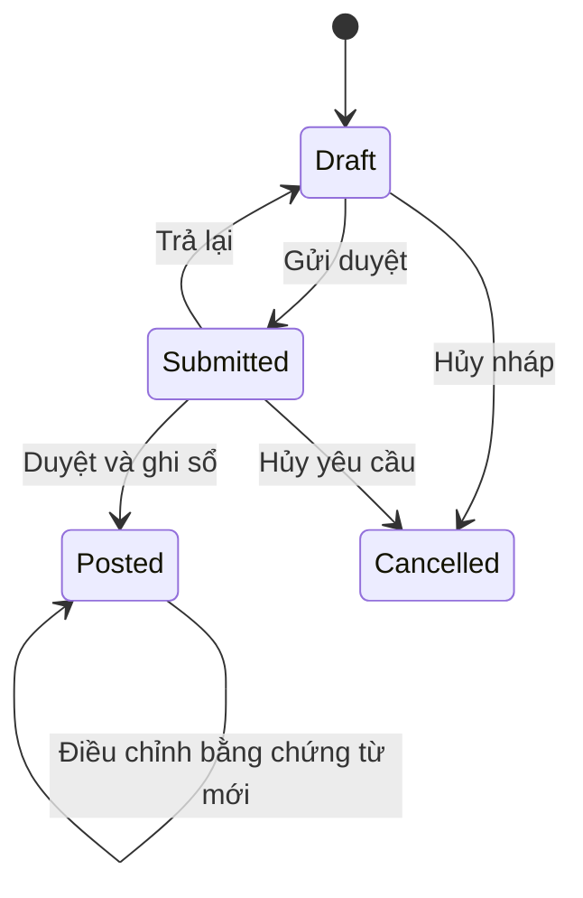

# Luồng nghiệp vụ và quy tắc tính

## 1. Dự án, gói thầu và hàng hóa

Dự án có nhiều gói thầu; mỗi gói có nhiều dòng kế hoạch. Mỗi dòng tham chiếu một mã hàng chuẩn nhưng giữ tên/mô tả theo hợp đồng. Một mã hàng được dùng trong nhiều dự án.

Không ghép hàng chỉ bằng tên gần giống. Model, hãng, đơn vị và quy cách phải phù hợp. Hàng thay thế model cần phụ lục/duyệt thay thế với dấu vết; không âm thầm đổi mã sản phẩm của dòng có phát sinh.

Kế hoạch đã phê duyệt được sửa qua phiên bản/phụ lục. Không hạ lượng dưới lượng bàn giao ròng, lượng đã xuất chưa bàn giao và nguồn hàng đang cam kết nếu chưa giải phóng/điều chỉnh phần liên quan.

## 2. Mua, nhận và giữ hàng

1. Lập kế hoạch giao của gói thầu.
2. Kiểm tra tồn khả dụng; tạo giữ hàng từ kho hiện có cho phần đáp ứng được.
3. Phần thiếu lập đơn mua; phân bổ lượng của dòng đơn mua cho từng dòng kế hoạch.
4. Đơn mua được duyệt mới cho nhập kho. Mỗi đợt nhận ghi rõ lượng, giá mua, serial và dòng đơn mua.
5. Khi ghi sổ nhận hàng, chuyển phần phân bổ đã nhận thành giữ hàng cho dự án **trong cùng transaction**, không đếm đồng thời vừa đang đặt vừa đang giữ.
6. Hàng mua dự trữ không cần dự án; chỉ được giữ khi có nhu cầu cụ thể.

Một đơn mua có thể phục vụ nhiều dự án. Tổng phân bổ không vượt lượng đặt còn hiệu lực. Khi nhận thiếu, người lập phải xác định lượng về cho từng phân bổ; không phân bổ mặc định trùng cho tất cả dự án.

## 3. Công thức nguồn hàng

Các công thức tính trên số lượng chuẩn, cùng một mã hàng và cùng phạm vi kho/dòng kế hoạch.

| Ký hiệu | Định nghĩa |
|---|---|
| `P` | Kế hoạch được duyệt hiện hành |
| `H` | Đã bàn giao, trừ hàng trả giảm giao đã được ghi nhận |
| `T` | Đã xuất giao nhưng chưa bàn giao, trừ phần hoàn nhập chưa bàn giao |
| `R` | Lượng đang giữ còn hiệu lực, chưa xuất |
| `O` | Lượng đơn mua còn chờ nhận được phân bổ cho dòng kế hoạch |
| `S` | Tồn thực tế ở kho |

- Còn bàn giao: `max(P - H, 0)`.
- Còn phải xuất: `max(P - H - T, 0)`.
- Còn cần nguồn hàng: `max(P - H - T - R - O, 0)`.
- Khả dụng tại kho: `S - tổng R tại kho`.
- Tiến độ bàn giao: `H / P`; nếu `P = 0` thì không tính phần trăm.

Không tự trừ toàn bộ tồn khả dụng của công ty vào nhu cầu của từng dự án: cùng một lượng hàng có thể bị tính cho nhiều dự án. Muốn tính là được đáp ứng thì phải giữ hàng hoặc phân bổ đơn mua.

Ví dụ `P=20`, `H=8`, `T=2`, `R=5`, `O=5`: còn bàn giao 12, còn xuất 10, còn cần mua 0. Số đã mua/nhận vẫn hiển thị riêng để tra cứu, không cộng lần nữa vào công thức.

## 4. Xuất giao và bàn giao

Phiếu xuất dự án bắt buộc gắn từng dòng với dòng kế hoạch. Hàng trong phiếu phải khớp hàng của kế hoạch hoặc có thay thế đã duyệt. Khi xuất từ lượng đã giữ, transaction giảm tồn, giảm lượng giữ, tăng lượng đang giao và ghi giá vốn.

Một phiếu có thể giao nhiều dòng và nhiều gói nhưng phải cùng đích nhận phù hợp; không có một trường projectId chung thay cho liên kết trên từng dòng.

Bàn giao tham chiếu dòng xuất đã ghi sổ và xác nhận được từng phần. Tổng bàn giao không vượt lượng xuất ròng chưa được xác nhận. Biên bản có ngày, người nhận, người xác nhận và tệp đính kèm.

Trạng thái vận hành gói: chưa thực hiện, chuẩn bị hàng, đang giao, đã giao đủ, hoàn tất. Hoàn tất đòi đủ bàn giao/nghiệm thu bắt buộc. Không lấy phần trăm làm tròn 100% để đóng dự án; so sánh lượng chính xác từng dòng.

Khi tổng hợp gói có đơn vị khác nhau, không cộng số máy với mét dây để tính tiến độ số lượng chung. Hiển thị số dòng hoàn thành/tổng dòng, hoặc tiến độ theo giá trị hợp đồng khi có đơn giá hợp lệ và ghi rõ cơ sở.

## 5. Chứng từ và ghi sổ

Trong bản đầu, duyệt và ghi sổ là một hành động nguyên tử; không có khoảng trống giữa trạng thái đã duyệt và tồn chưa cập nhật. Chứng từ giữ nguyên trạng thái `posted` sau điều chỉnh; lịch sử và các lượng ròng được suy từ chứng từ điều chỉnh liên kết.

Ghi sổ phải đồng thời: kiểm tra phiên/quyền/kỳ khóa, khóa số dư, kiểm tra phiên bản chứng từ, kiểm tra số lượng/serial/nguồn, cập nhật sổ, số dư, giữ hàng, phân bổ, giá vốn và audit. Bất kỳ bước nào lỗi thì rollback tất cả.

Chứng từ đã ghi sổ không sửa các trường tác động tồn/giá. Sửa ghi chú không tác động tài chính vẫn lưu lịch sử trước/sau. Đảo chứng từ chỉ thực hiện nếu không vi phạm tồn hoặc liên kết phía sau; có chứng từ phụ thuộc thì phải xử lý phụ thuộc trước.

## 6. Chuyển kho và giao thẳng

- Chuyển kho bản đầu là tức thời: một phiếu, hai biến động nguồn/đích trong cùng transaction, không đổi giá vốn toàn công ty.
- Không chuyển phần đang giữ nếu không đồng thời chuyển giữ hàng cùng dự án; bản đầu chặn và yêu cầu giải phóng/tạo lại giữ hàng có kiểm soát.
- Giao thẳng dùng kho trung chuyển ảo `DIRECT`: nhận từ NCC và xuất giao liên kết trong cùng transaction, số dư trung chuyển bằng 0 sau khi hoàn thành. Không tăng tồn kho công ty đang giữ vật lý. Tiến độ chỉ hoàn thành khi có xác nhận nhận hàng/bàn giao.
- Không triển khai chuyển kho vận chuyển nhiều ngày trong bản đầu; nếu cần sẽ thêm kho đang vận chuyển và hai mốc xuất/nhận.

## 7. Trả hàng

| Loại | Tham chiếu | Tồn | Tiến độ |
|---|---|---|---|
| NCC nhận hàng trả | Dòng nhập mua gốc | Giảm tại kho trả | Giảm nguồn hàng nếu có phân bổ; không tự tăng đơn mua chờ nhận |
| Khách trả giảm giao | Dòng bàn giao gốc | Tăng kho nhận | Giảm bàn giao ròng, mở lại nhu cầu |
| Hoàn nhập chưa bàn giao | Dòng xuất gốc chưa bàn giao | Tăng kho nhận | Giảm đang giao; có thể giữ lại cho dự án theo lựa chọn |
| Đổi hàng | Dòng giao gốc và cặp nhận/xuất thay thế | Theo từng phiếu | Không ghi thêm hoàn thành cho cùng nghĩa vụ hợp đồng |
| Bảo hành | Serial và bàn giao gốc | Vào kho hàng khách gửi riêng | Không tăng tồn sở hữu công ty, không giảm hoàn thành |

Tổng trả không vượt lượng nguồn ròng còn có thể trả; serial trả phải đúng serial đã giao/nhận. Khách trả dùng giá vốn đã chốt ở dòng xuất gốc, không dùng giá vốn hiện tại.

Hàng hỏng hoặc chờ kiểm tra vào kho cách ly; kho này không được chọn để giữ/xuất giao. Hàng khách gửi không đưa vào giá trị tồn sở hữu công ty.

## 8. Giá vốn

Áp dụng bình quân gia quyền liên hoàn toàn công ty cho tồn sở hữu. Lưu `quantity` và `inventory_value` chính xác theo sản phẩm; giá vốn suy từ hai giá trị, không làm tròn sớm rồi nhân ngược để tính giá trị tồn.

- Nhập: `Q_mới = Q_cũ + q`, `V_mới = V_cũ + giá_trị_nhập`, giá vốn `V_mới/Q_mới`.
- Xuất: chốt giá vốn hiện hành trên dòng xuất; trừ giá trị tương ứng khỏi `V`. Khi xuất hết tồn, lấy hết giá trị còn lại để xử lý sai số làm tròn.
- Chuyển kho: không làm thay đổi `Q`, `V` toàn công ty.
- Khách trả: cộng lượng và giá trị theo giá vốn xuất gốc; từ đó tính bình quân mới.
- Trả NCC: giảm giá trị tồn theo giá vốn hiện hành; giá NCC hoàn ghi riêng. Không giả định giá hoàn bằng giá vốn.
- Đảo nhập trong kỳ chưa có giao dịch phụ thuộc: trừ đúng giá trị nhập gốc. Nếu đã có xuất hoặc tái tính bị ảnh hưởng thì không tự đảo đơn giản; dùng quy trình điều chỉnh giá trị được duyệt.
- Điều chỉnh giảm kiểm kê dùng giá vốn hiện hành. Điều chỉnh tăng khi chưa có giá vốn bắt buộc khai giá được duyệt.

Khóa kỳ theo ngày nghiệp vụ. Không ghi sổ lùi trước các biến động đã chốt giá của sản phẩm nếu chưa có dịch vụ tái tính được kiểm thử; bản đầu yêu cầu ngày hiện tại hoặc chứng từ điều chỉnh kỳ mở. Ngày trên chứng từ gốc có thể lưu riêng để tra cứu.

## 9. Kiểm kê, serial và công nợ

Kiểm kê chốt phạm vi sản phẩm/kho và mốc đếm. Bản đầu tạm khóa phát sinh trong phạm vi đang kiểm kê; đóng phiên phải mở khóa ngay. Ghi phiếu điều chỉnh chênh lệch một lần sau duyệt, không ghi đè số dư.

Sản phẩm theo serial phải có lượng nguyên; số serial khớp lượng. Serial được chuẩn hóa, không trùng cho cùng sản phẩm; một serial chỉ có một vị trí/trạng thái hiện hành. Phiếu trả có thể tái sử dụng serial đã xuất đúng nguồn, không bị coi là serial mới trùng.

Bản đầu chưa làm sổ công nợ/thanh toán. Báo cáo đơn mua và giá trị hợp đồng không thay thế sổ kế toán.
