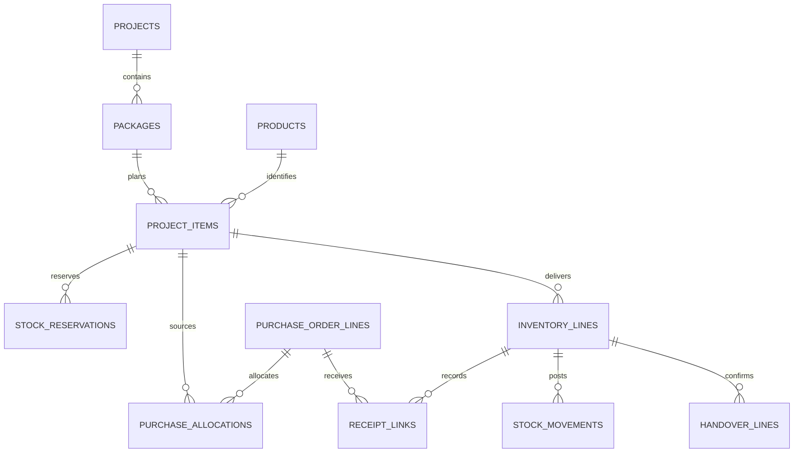

# Từ điển dữ liệu và quan hệ

Đây là mô hình logic PostgreSQL, **chưa phải migration SQL chạy trên môi trường thật**. Mọi bảng dùng UUID làm ID, có `created_at`, `created_by` khi có người tạo. Bảng chỉnh sửa có `version` nguyên tăng dần để kiểm soát cập nhật đồng thời. Bảng chứng từ và lịch sử không cascade delete.

## 1. Quan hệ cốt lõi

Sơ đồ thể hiện các liên kết nghiệp vụ chính. Các khóa kho, sản phẩm, chứng từ cha và người dùng được mô tả dưới đây để tránh sơ đồ quá lớn.

## 2. Danh tính và danh mục

| Bảng | Trường chính | Ràng buộc |
|---|---|---|
| `users` | username, display_name, password_hash, active, session_version | username chuẩn hóa duy nhất; không xóa người có lịch sử |
| `roles`, `permissions` | code, name | code duy nhất |
| `user_roles`, `role_permissions` | Hai FK tương ứng | Khóa ghép duy nhất |
| `sessions` | user_id, token_hash, expires_at, revoked_at | Chỉ lưu hash token; có thể thu hồi |
| `project_members` | project_id, user_id, permission_scope | Một bản ghi trên mỗi người/dự án |
| `units` | code, name | code duy nhất |
| `products` | sku, name, model, maker, unit_id, track_serial, active | sku chuẩn hóa duy nhất; không đổi chế độ serial sau phát sinh nếu chưa chuyển đổi |
| `warehouses` | code, name, kind, available_for_reservation, active | kind: owned, quarantine, customer_custody, direct |
| `partners` | code, name, tax_code, address, is_customer, is_supplier | Một đối tác có thể là khách và NCC |

Không dùng một trường `costPrice` do người dùng sửa tự do trong danh mục sản phẩm. Giá vốn nằm ở sổ định giá. Giá bán tham khảo nếu có không thay cho giá bán hợp đồng.

## 3. Dự án và mua hàng

| Bảng | Trường chính | Ràng buộc |
|---|---|---|
| `projects` | code, name, customer_id, owner_user_id, status | code duy nhất; quyền theo project_members |
| `packages` | project_id, code, name, deadline, contract_value, acceptance_required | Mã gói nếu nhập phải duy nhất theo quy ước mã đã thống nhất; không dùng tên để làm khóa |
| `project_items` | package_id, line_no, product_id, contract_name, contract_unit, conversion_factor, plan_qty, sale_price, deadline, revision_id | plan_qty ≥ 0; conversion_factor > 0; unique(package_id, line_no) |
| `project_revisions` | project_id, number, reason, approved_by, approved_at, attachment_id | Snapshot trước/sau; chỉ bản duyệt tác động kế hoạch |
| `purchase_orders` | code, supplier_id, status, ordered_date, expected_date, version | Trạng thái draft/submitted/approved/closed/cancelled |
| `purchase_order_lines` | order_id, product_id, ordered_qty, cancelled_qty, unit_price, expected_date | ordered_qty > 0; cancelled_qty ≥ 0; không hủy phần đã nhận |
| `purchase_allocations` | order_line_id, project_item_id, allocated_qty, cancelled_qty | Hàng hai phía khớp; tổng phân bổ hiệu lực không vượt lượng đơn |
| `receipt_links` | inventory_line_id, order_line_id, allocation_id nullable, qty | qty > 0; tổng link bằng lượng nhận theo nguồn trên dòng |

Số đã nhận và số đang đặt tính từ receipt_links cùng chứng từ đã ghi sổ và các liên kết trả/điều chỉnh, không là ô cho người dùng nhập tay. Đơn mua đóng phần còn lại phải ghi rõ lượng hủy và giải phóng phân bổ.

## 4. Kho, giữ hàng và giá vốn

| Bảng | Trường chính | Ràng buộc |
|---|---|---|
| `inventory_documents` | code, type, status, business_date, source_date, supplier_or_customer_id, submitted_by, posted_by, posted_at, reason, version | code duy nhất; chỉ transition hợp lệ; không xóa đã ghi sổ |
| `inventory_lines` | document_id, line_no, product_id, warehouse_id, to_warehouse_id nullable, qty, unit_price, cost_value, project_item_id nullable | unique(document_id,line_no); qty > 0; loại phiếu quyết định chiều; chuyển kho nguồn khác đích |
| `stock_movements` | document_line_id, warehouse_id, product_id, signed_qty, posted_at | Append-only; chuyển kho đúng 2 chân; không ghi ngoài dịch vụ ghi sổ |
| `stock_balances` | warehouse_id, product_id, quantity, reserved_qty, version | PK(warehouse_id,product_id); quantity ≥ 0; 0 ≤ reserved_qty ≤ quantity |
| `stock_reservations` | warehouse_id, project_item_id, product_id, reserved_qty, released_qty, consumed_qty, status | Lượng còn giữ = reserved − released − consumed ≥ 0 |
| `reservation_consumptions` | reservation_id, inventory_line_id, qty | qty > 0; đối soát được lượng giữ đã dùng |
| `product_valuations` | product_id, quantity, inventory_value, version | Khóa toàn sản phẩm khi định giá; chỉ tồn sở hữu; quantity ≥ 0 |
| `valuation_movements` | document_line_id, signed_qty, signed_value, source_valuation_id nullable | Append-only; liên kết với chứng từ gốc khi trả/đảo |
| `return_links` | return_line_id, source_line_id, handover_line_id nullable, qty, return_kind | Tổng trả không vượt lượng nguồn còn được trả |
| `document_adjustments` | original_document_id, adjustment_document_id, reason | Hai ID khác nhau; không vòng tham chiếu |

Không đặt đơn giá có dấu âm để mô tả nhập/xuất. `qty` trên phiếu là trị tuyệt đối dương; loại phiếu quyết định dấu sổ. Phiếu kiểm kê tách direction hoặc loại tăng/giảm.

Các invariant tổng hợp qua nhiều dòng không thể chỉ dùng CHECK. Phải có transaction, row locks và kiểm thử cạnh tranh; trigger có thể bảo vệ tính bất biến của sổ và chứng từ đã ghi sổ.

## 5. Serial, bàn giao và kiểm kê

| Bảng | Trường chính | Ràng buộc |
|---|---|---|
| `product_serials` | product_id, serial_normalized, serial_display, warehouse_id nullable, state, ownership | unique(product_id,serial_normalized); state available/reserved/dispatched/customer/custody |
| `serial_movements` | serial_id, inventory_line_id, from_state, to_state, posted_at | Append-only, một serial không xuất hai lần đồng thời |
| `reservation_serials` | reservation_id, serial_id | Một serial chỉ nằm trong một giữ hàng hiệu lực |
| `inventory_line_serials` | inventory_line_id, serial_id | Khóa ghép; đếm khớp qty của dòng serial |
| `handovers` | code, customer_id, date, recipient_name, confirmed_by, confirmed_at, status | draft/confirmed; đã xác nhận điều chỉnh bằng bản liên kết |
| `handover_lines` | handover_id, dispatch_line_id, qty | Tổng xác nhận không vượt lượng xuất có thể bàn giao |
| `handover_line_serials` | handover_line_id, serial_id | Serial phải nằm trong dòng xuất nguồn, chưa bàn giao ở nguồn khác |
| `stock_counts` | warehouse_id, started_at, closed_at, status, approved_by | Một phạm vi sản phẩm chỉ có một phiên mở |
| `stock_count_lines` | stock_count_id, product_id, system_qty, counted_qty | counted_qty ≥ 0; snapshot system_qty tại mốc khóa |
| `stock_count_serials` | count_line_id, serial_id nullable, observed_serial | Lưu serial đếm và xử lý serial chưa nhận diện trước duyệt |
| `stock_count_adjustments` | stock_count_id, adjustment_document_id | Một lần ghi điều chỉnh mỗi phiên đã duyệt |

Hàng khách gửi bảo hành ở `customer_custody` có ownership=customer; không đưa vào product_valuations của công ty. Theo dõi khách gửi và dòng bàn giao gốc qua hồ sơ gửi/nhận khi triển khai bảo hành; bản đầu chỉ tiếp nhận và trả lại, chưa có cổng khách hàng.

## 6. Kiểm soát và chuyển đổi

| Bảng | Trường chính | Ràng buộc |
|---|---|---|
| `audit_logs` | actor_id, action, entity_type, entity_id, before_json, after_json, request_id, at | Append-only; không ghi mật khẩu, session token |
| `accounting_periods` | start_date, end_date, locked_at, locked_by | Không chồng lấn; kiểm tra trước ghi sổ |
| `idempotency_keys` | actor_id, operation, key, request_hash, response_json, status | unique(actor_id,operation,key); cùng key khác payload trả 409 |
| `attachments` | object_key, original_name, mime_type, size, uploaded_by | Lưu bên ngoài Git; tải theo quyền của đối tượng gắn tệp |
| `entity_attachments` | attachment_id, entity_type, entity_id | Kiểm tra thực thể đích tồn tại và quyền truy cập |
| `migration_batches` | source, source_digest, cutoff_at, status, report_json | Import chỉ sau đối soát và phê duyệt |
| `legacy_mappings` | batch_id, source_system, entity_type, legacy_id, target_id | unique(source_system,entity_type,legacy_id); chống nhập lại |
| `migration_issues` | batch_id, source_ref, reason, resolution, resolved_by | Lỗi chưa giải quyết chặn hoàn tất |

## 7. Index và vòng đời

- Index mọi FK dùng join thường xuyên, ngày/trạng thái chứng từ, cặp hàng/kho và tham chiếu nguồn.
- Code được chuẩn hóa bằng cùng một hàm ở API/import; kiểm tra duy nhất theo cột chuẩn hóa, tránh khác biệt viết hoa tiếng Việt giữa JavaScript và SQL.
- Không cascade delete từ dự án sang sổ kho, phiếu hoặc bàn giao. Chỉ cho xóa nháp không phát sinh; danh mục đã dùng chuyển inactive.
- Stock balance và valuation balance phải được dựng lại từ sổ để đối soát. Chênh lệch phải điều tra; không tự ghi đè để che lỗi.
- Truy vấn bàn giao/nhập/xuất luôn lọc chứng từ có hiệu lực; không tính nháp hoặc phiếu bị hủy trước ghi sổ.
